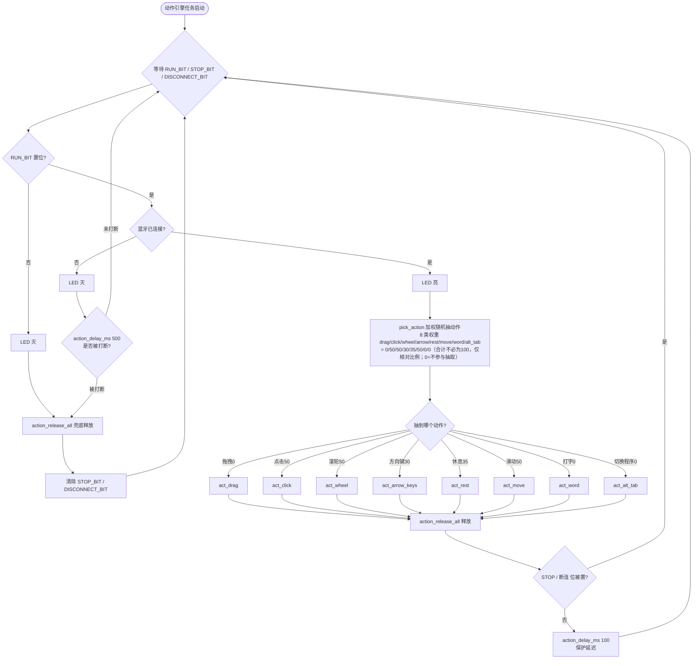
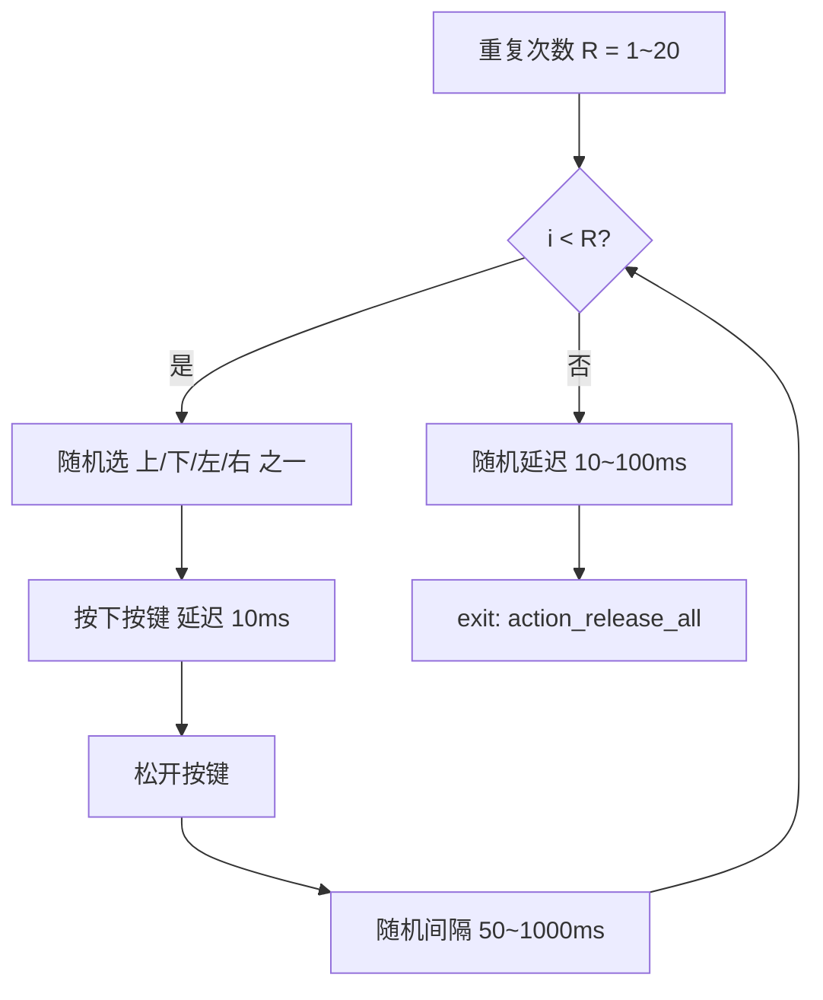
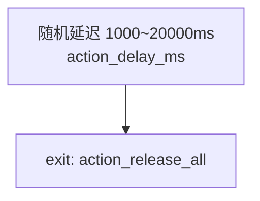

# 程序逻辑说明（当前实现）

> 本文档描述当前代码的实际运行逻辑，便于核对。代码位置：`main/action_engine.c`、`main/action_engine.h`、`main/hid_keys.c`、`main/main.c`、`main/ble_hid.c`。

## 1. 总体架构

设备作为 BLE HID 复合设备（鼠标 + 键盘）连接电脑。**默认处于停止状态**，不执行任何动作。用户按 `KEY2` 启动、`KEY0` 停止、`KEY1+KEY3` 长按 3 秒重置蓝牙。

并发模型（沿用旧工程）：

```
按键任务(hid_keys)  --事件-->  EventGroup  <--读取--  动作引擎任务(action_engine)
                                                        |
                                              （执行动作时）发送 HID 报文
                                                        |
                                                  FreeRTOS 队列
                                                        |
                                                  hid_sender_task（串行发送）
                                                        |
                                                  esp_hidd_dev_input_set()
                                                        |
                                                      电脑
```

## 2. 状态与控制面

| 按键 | 引脚位映射 | 行为 |
|---|---|---|
| KEY2 | bit1 (P1_5) | 下降沿 → `action_engine_start()`（仅停止态生效，置 RUN_BIT） |
| KEY0 | bit3 (P1_7) | 下降沿 → `action_engine_stop()`（清 RUN_BIT，置 STOP_BIT 唤醒延迟） |
| KEY3 | bit0 (P1_4) | 下降沿 → `action_engine_stop_and_reset()`：停止动作并复位鼠标位置（供确认落点，**停止态下同样执行复位**） |
| KEY1 | bit2 (P1_6) | **短按（松开且未触发组合键）→ `action_engine_add_runtime()`：运行额度 +10 分钟，并通知 LED 任务“闪一下”确认**（不跟时间挂钩）；未运行则自动启动，已运行则累加；额度耗尽自动停止。LED 的实际闪烁频率由独立 `led_control_task` 按剩余时间决定（见下） |
| KEY1+KEY3 | bit2(P1_6)+bit0(P1_4) | 同时长按 3 秒 → 先 `action_engine_stop_and_wait()`，再 `ble_hid_reset()`（仅清蓝牙）；若在**本次长按松开后 5 秒内**再次长按 3 秒，则额外调用 `web_factory_reset()` 恢复出厂（Web 账号重置为 admin/admin，全部参数恢复默认并落盘）。组合键生效期间屏蔽 KEY3 单按复位与 KEY0/KEY2 边沿判定，避免误触发 |
| BOOT(GPIO0) | GPIO0 | 板载 BOOT 键（独立于 XL9555，始终可用）：**短按** → 切换动作启停（运行↔停止）；**长按 ≥3 秒** → 重置蓝牙（同 KEY1+KEY3）；若松开后 5 秒内再次长按 3 秒 → 恢复出厂（账号+参数），效果等同 KEY1+KEY3 组合键 |

EventGroup 位定义：

- `RUN_BIT (bit0)`：用户已按 KEY2 启动
- `STOP_BIT (bit1)`：用户按 KEY0 停止（仅用于唤醒延迟）
- `DISCONNECT_BIT (bit2)`：蓝牙断开，中止当前动作

LED（GPIO1）：由**独立 `led_control_task`** 统一驱动，不再由动作引擎零散控制：
- 停止（RUN_BIT 未置位）→ 灭（高电平）
- 非定时运行（KEY2 启动、无额度）→ 常亮（低电平）
- 定时运行（Key1 累加额度，或**配置了“定时停止”任务**）→ 按剩余时间决定闪烁频率：每 1 分钟对应 50ms 间隔（如 10 分钟 → 500ms；剩余越短闪得越快，下限 50ms，上限 2000ms 即最长 2s 闪一次）
- **定时停止倒计时**：运行中若检测到启用的 `TIMER_START_STOP + ss_action=1` 规则，调度任务每 tick 取“最近的停止时刻”作为到期点；LED 按“距离停止还有多久”闪烁（无 Key1 额度时该停止时刻即实际到期点，到点自动 `action_engine_stop()`）；若同时有 Key1 额度，则取其更早者先到期。

## 8. WiFi 与 Web 配置（新增）

设备启动后**始终开启 SoftAP 热点** `KM-Config`（密码 `12345678`，IP `192.168.4.1`），
并可**并发**连接路由器 STA（凭据来自 NVS，由 Web 页面填写保存）。AP 永不关闭——
无论 STA 是否连上、是否知道 STA 的局域网 IP，都能通过 AP 的 `192.168.4.1` 访问页面；
STA 连上路由器后其局域网 IP 同样可访问（HTTP Server 监听 `0.0.0.0`，双网段共享）。

代码位置：`main/wifi_manager.c/.h`、`main/web_server.c/.h`、`main/config_store.c/.h`。

### 8.1 启动顺序（`app_main`）

```
1. init_nvs             NVS（含 BLE 绑定 + km_cfg 命名空间）
2. led_status_init
3. hid_sender_start
4. config_store_load   从 NVS 读取 km_cfg，无则写默认（须在 ble_hid_init / wifi_manager_start 之前，供其读取射频功率与 STA 配置）
5. wifi_manager_start  常开 SoftAP + 按配置并发连 STA（须早于 BLE，避免 coexistence 把已连 STA 踢掉）
   5.1 wifi_manager_wait_sta_connected(8000)  阻塞等待 STA 连上路由器（最多 8s，未配/超时立即返回）
6. ble_hid_init         BLE 广播
7. action_engine_start_task
8. keys_start           物理按键控制面（KEY0/KEY2/KEY3/KEY1+KEY3）；BOOT 键(GPIO0) 监控亦在此启动
9. action_engine_apply_config  应用模式/权重/序列到引擎
10. web_server_start     HTTP+页面（AP/STA 均可访问）
11. action_engine_start_scheduler  定时扫描任务（每秒一次）
```

### 8.2 配置持久化

所有配置打包为 `config_t`，以 NVS blob 存于命名空间 `km_cfg`（key=`cfg`），断电不丢失。
结构含：`version / run_mode / weights(八类权重) / sequence(≤32 项+循环策略) / timers(≤8 条) / wifi(STA 凭据)`。

### 8.3 Web 控制台功能

- **状态栏**：AP IP、STA IP、蓝牙连接状态、引擎运行状态、启动/停止按钮（每秒轮询 `/api/status`）。
- **运行模式**：随机模式（八类权重数字输入，实时显示合计）/ 序列模式（切换选项卡）。
- **动作序列编排**：从八类动作添加/上移/下移/删除；循环策略可选「顺序循环」或「乱序洗牌」。
- **定时任务**：三类规则（可多条）——定时启停（每天到时启动/停止引擎）、定时单动作（到点执行一次指定动作）、周期循环（每 N 分钟执行一轮序列）。
- **WiFi 配网**：填写路由器 SSID/密码并「保存并连接」，设备并发联网，AP 不关闭。

### 8.4 REST 接口（`main/web_server.c`）

| 接口 | 方法 | 说明 |
|---|---|---|
| `/` | GET | 内置控制台页面 |
| `/api/status` | GET | `{ap_ip, sta_ip, bt, running}` |
| `/api/config` | GET | 当前配置 JSON |
| `/api/config` | POST | 保存配置并实时应用到引擎 |
| `/api/control` | POST | `{"action":"start"\|"stop"}` 启停引擎 |
| `/api/wifi` | POST | `{"ssid","pass"}` 保存并连路由器 |
| `/api/login` | POST | `{"user","pass"}` 校验用户名/密码，成功返回 Bearer token |
| `/api/logout` | POST | 清除当前会话 token |
| `/api/setauth` | POST | 修改登录用户名/密码（需登录，写入 NVS 持久化） |
| `/api/factory_reset` | POST | 恢复出厂设置（需登录）：登录账号重置为 admin/admin，并重置全部参数到默认值，立即写入 NVS |

### 8.5 动作引擎扩展

- 随机模式：`pick_action()` 按运行时可配权重 `s_weights`（覆盖头文件宏默认）抽取。
- 序列模式：主循环按 `s_seq_cursor` 取动作；`CYCLE_ORDERED` 顺序循环，`CYCLE_SHUFFLE` 每轮结束重新 Fisher–Yates 洗牌。
- 定时扫描任务 `scheduler_task`：每秒检查规则，到点设置/清除 RUN_BIT、调用 `action_engine_run_single()` 或 `action_engine_trigger_sequence_once()`。
  计时优先用 SNTP 真实时间（STA 连上路由器校时）；未联网时回落为开机累计软时钟（从 00:00:00 起）。

### 8.6 硬件兼容

面向 4MB Flash + 2MB PSRAM 的小外扩 ESP32-S3（如 WROOM-1-N4R2）：
`sdkconfig.defaults.esp32s3` 已设 4MB Flash + `SINGLE_APP_LARGE` 分区 + 开启 PSRAM/WiFi/HTTP/SNTP；
页面全内嵌 Flash 常量，配置 RAM < 1KB，不引入文件系统。
- 收到 Key1 短按的“闪一下”通知 → 插入一次确认闪烁（亮-灭-亮-灭），不跟时间挂钩
（低电平亮、高电平灭，沿用 GPIO1 推挽直驱）

## 3. 主循环流程图（动作引擎核心）



**关键点**：每个动作函数内部各自包含“动作内随机延迟”，动作结束后回到主循环，再追加 **100ms 保护延迟**，然后重新抽下一个动作。休息动作与其他动作地位平等，都在 `pick_action()` 的抽取范围内，且休息的 1~30s 延迟就在 `act_rest()` 内部。

## 4. 各动作内部逻辑

### 4.1 模拟鼠标拖拽（15%）

```mermaid
flowchart TD
    A[重复次数 R = 1~5] --> B[按下鼠标左键]
    B --> C{i < R?}
    C -- 是 --> D[随机目标点(范围内)<br/>mouse_move_to 分片步进<br/>每段间隔 ACTION_MOVE_STEP_MS=28ms]
    D --> E[随机间隔 100~500ms<br/>action_delay_ms]
    E --> C
    C -- 否 --> F[松开左键]
    F --> G[鼠标复位 action_mouse_home]
    G --> H[随机延迟 100~500ms]
    H --> I[exit: action_release_all]
```

> 注：拖拽的目标点用“随机目标点 + 受限步进移动”实现，`DRAG_DIST_*`/`DRAG_STEP_*` 距离类宏当前已不再被动作代码直接引用（保留以备改回角度/距离式移动），真实重复/间隔参数见 §7 宏表。

### 4.2 模拟鼠标点击（20%）

```mermaid
flowchart TD
    A[重复次数 R = 1~10] --> B{i < R?}
    B -- 是 --> C[随机目标点(范围内)<br/>mouse_move_to 分片步进移动<br/>不瞬移]
    C --> D[按下左键]
    D --> E[延迟 20ms]
    E --> F[松开左键]
    F --> G[随机间隔 300~1000ms]
    G --> B
    B -- 否 --> H[鼠标复位]
    H --> I[随机延迟 300~1000ms]
    I --> J[exit: action_release_all]
```

### 4.3 模拟鼠标滚轮（40%）

```mermaid
flowchart TD
    A[随机目标点(范围内) 步进移动一下] --> B[重复次数 R = 1~5]
    B --> C{i < R?}
    C -- 是 --> D[随机上下方向<br/>随机步进 1~5<br/>累加 wheel_sum]
    D --> E[mouse_wheel 发送]
    E --> F[随机间隔 50~500ms]
    F --> C
    C -- 否 --> G[发送 -wheel_sum 精确归位]
    G --> H[鼠标复位]
    H --> I[随机延迟 50~500ms]
    I --> J[exit: action_release_all]
```

### 4.4 模拟键盘方向键（20%）



### 4.5 模拟休息（35%）



> 休息也是一个正常动作：被抽中后，引擎在 `act_rest()` 内部等待 1~30s，期间 LED 保持亮（仍在 RUN 态），延迟可被 STOP/断连中断。

## 5. 公共子过程

### 5.1 鼠标活动范围限制（相对屏幕中心，全程生效）
- 引擎维护一个逻辑光标坐标 `(s_cur_x, s_cur_y)`，以屏幕中心为原点；
- **全程限制**：该坐标在整个动作生命周期内（跨多次移动、跨所有动作）都被钳制在矩形范围内，不是单次。每次 `mouse_move_to()` 都从 `s_cur` 计算相对位移并钳制目标点，因此 `s_cur` 永远落在范围内；
- 基准范围（未折算缩放）：
  - `x ∈ [-MOUSE_POS_LIMIT_X, +MOUSE_POS_LIMIT_X]`（默认 ±500 像素）
  - `y ∈ [-MOUSE_POS_LIMIT_Y, +MOUSE_POS_LIMIT_Y]`（默认 ±200 像素）
- **屏幕缩放折算**：主机显示缩放会让同样的 HID 相对位移产生不同的实际移动量。有效范围按缩放折算：
  - `MOUSE_POS_EFF_X = MOUSE_POS_LIMIT_X * 100 / SCREEN_SCALE_PCT`
  - `MOUSE_POS_EFF_Y = MOUSE_POS_LIMIT_Y * 100 / SCREEN_SCALE_PCT`
  - 例如 125% 缩放下，有效水平半范围 = 500×100/125 = 400 像素。缩放越大允许的逻辑移动越小，真实光标越不易出界；
- 移动采用 `mouse_move_to()`：从当前逻辑位置**分片步进**到目标点（单帧 ≤25 计数 `ACTION_MOVE_CHUNK_MAX`，帧间可中断延迟 `ACTION_MOVE_STEP_MS` 默认 28ms），绝不瞬移，因此光标不会"闪烁"跳过，也不会飘出活动范围；
- 复位（撞角→回中心）时不走范围限制（需物理移出屏幕），复位完成后逻辑坐标重置为 (0,0) 即屏幕中心，随后所有移动重新受有效范围约束。

### 5.2 鼠标复位 `action_mouse_home`
- 复位目标角落由宏 `MOUSE_HOME_CORNER` 配置，可选 `CORNER_TOP_RIGHT`（右上）、`CORNER_TOP_LEFT`（左上）、`CORNER_BOTTOM_RIGHT`（右下）、`CORNER_BOTTOM_LEFT`（左下）。默认 `CORNER_TOP_RIGHT`。
- BLE 鼠标是相对位移协议，读不到光标绝对位置；且 Windows 对 HID 相对位移有**指针加速**，按“半屏几何”回中心不可靠（推/回不抵消）。实测 1080@125% 与 2560@100% 两屏落点“感觉差不多、都偏出屏幕”，印证与屏幕数值无关，是系统加速导致。故复位改为**经验值两步法**，**且不依赖撞角前的光标位置**：
  1. **撞角**：朝 `MOUSE_HOME_CORNER` 配置角落方向发出 `MOUSE_HOME_PUSH_PX`（分片）。只要该值足够大，真实光标越过屏幕角落边界、被系统截停在角落（绝对位置已知），用于确认撞角方向；
  2. **回中心**：朝撞角反方向发出 `MOUSE_HOME_BACK_X` / `MOUSE_HOME_BACK_Y`（经验常量，分片，X/Y 独立），决定最终落点。撞角余量已在角落被截掉，故 BACK 不必等于 PUSH 的一半，需实测收敛。屏幕宽高比≠1 且系统对 X/Y 加速可能不同，单值会导致落点呈“正方形”偏移，故必须 X/Y 分开调。
- 两个值均为“发送的位移计数”而非物理像素，与起始位置、屏幕缩放无关，但需按实测落点调校（见 §8.3）。
- 逻辑坐标 `s_cur` 在复位结束时归零（仅用于后续动作取点，不影响复位落点）。
- **手动确认落点**：按 `KEY3`（短按，下降沿）会调用 `action_engine_stop_and_reset()`——先停止动作并释放全部按键，再执行一次复位。该操作**不依赖运行状态**（停止态下同样会执行复位），仅在蓝牙已连接时才真正发送 HID 报文；蓝牙未连接时只停动作并打印告警。可用它来核对复位的最终落点是否在屏幕中心附近。

### 5.3 释放全部 `action_release_all`
- 发送 `buttons=0` 的鼠标报文；
- 依次发送 上/下/左/右 方向键的“松开”报文。
- 每个动作函数的唯一出口都调用它，主循环 STOP 分支再兜底一次，杜绝按键残留。

### 5.4 可中断延迟 `action_delay_ms(ms)`
- 基于 `xEventGroupWaitBits(STOP_BIT | DISCONNECT_BIT, ...)`，最长等待 `ms`；
- 若 STOP/断连位置位则立即返回 `false`，调用方逐层退出并收尾；
- 因此“停止响应延迟”≤ 一次分片延迟（约 8~10ms）。

## 6. 当前逻辑与你描述的对照

你提到“每个动作内部都有随机延迟，休息也是一个动作”。当前实现**正是如此**：

- 拖拽/点击/滚轮/方向键 各自在循环**内部**插入文档规定的随机间隔；
- 休息作为一个独立动作，其 1~30s 随机延迟就在 `act_rest()` **内部**；
- 动作之间的串联是“抽一个 → 做完 → 回主循环 → 抽下一个”，**不是**把所有动作塞进一个长序列里。

## 7. 全部可调参数（已宏化，集中在 action_engine.h）

所有概率与频率数值都在 `main/action_engine.h` 中定义为宏，修改时**只需改这一个文件**，无需动逻辑代码：

| 宏名 | 含义 | 当前值 |
|---|---|---|
| `ACT_W_DRAG` | 拖拽概率权重 | 0 |
| `ACT_W_CLICK` | 点击概率权重 | 50 |
| `ACT_W_WHEEL` | 滚轮概率权重 | 50 |
| `ACT_W_ARROW` | 方向键概率权重 | 30 |
| `ACT_W_REST` | 休息概率权重 | 35 |
| `ACT_W_MOVE` | 滑动概率权重 | 50 |
| `ACT_W_WORD` | 打字概率权重 | 0 |
| `ACT_W_ALT_TAB` | 切换程序概率权重 | 0 |
| `DRAG_DIST_MIN/MAX` | 拖拽距离（动作内随机目标点范围） | 20 / 100 |
| `DRAG_STEP_MIN/MAX` | 拖拽分片步进（每帧位移量，预留未直接使用） | 1 / 20 |
| `DRAG_REPEAT_MIN/MAX` | 拖拽重复次数 | 1 / 5 |
| `DRAG_INTERVAL_MIN/MAX` | 拖拽间隔(ms) | 600 / 1500 |
| `DRAG_END_DELAY_MIN/MAX` | 拖拽结束延迟(ms) | 500 / 5000 |
| `CLICK_DIST_MIN/MAX` | 点击移动距离 | 10 / 100 |
| `CLICK_STEP_MIN/MAX` | 点击分片步进（预留未直接使用） | 1 / 30 |
| `CLICK_REPEAT_MIN/MAX` | 点击重复次数 | 1 / 10 |
| `CLICK_HOLD_MIN/MAX` | 点击左键保持(ms) | 20 / 250 |
| `CLICK_INTERVAL_MIN/MAX` | 点击间隔(ms) | 100 / 1000 |
| `CLICK_END_DELAY_MIN/MAX` | 点击结束延迟(ms) | 1000 / 5000 |
| `WHEEL_STEP_MIN/MAX` | 滚轮移动步长（预留未直接使用） | 1 / 30 |
| `WHEEL_REPEAT_MIN/MAX` | 滚轮重复次数 | 1 / 5 |
| `WHEEL_INTERVAL_MIN/MAX` | 滚轮间隔(ms) | 100 / 500 |
| `WHEEL_TICK_MIN/MAX` | 滚轮步进 | 1 / 8 |
| `WHEEL_END_DELAY_MIN/MAX` | 滚轮结束延迟(ms) | 1000 / 5000 |
| `ARROW_REPEAT_MIN/MAX` | 方向键重复次数 | 1 / 20 |
| `ARROW_INTERVAL_MIN/MAX` | 方向键间隔(ms) | 50 / 800 |
| `ARROW_END_DELAY_MIN/MAX` | 方向键结束延迟(ms) | 1000 / 5000 |
| `REST_DELAY_MIN/MAX` | 休息延迟(ms) | 1000 / 20000 |
| `MOVE_DIST_MIN/MAX` | 滑动距离 | 10 / 30 |
| `MOVE_STEP_MIN/MAX` | 滑动分片步进 | 1 / 15 |
| `MOVE_REPEAT_MIN/MAX` | 滑动重复次数 | 1 / 20 |
| `MOVE_INTERVAL_MIN/MAX` | 滑动间隔(ms) | 100 / 500 |
| `MOVE_END_DELAY_MIN/MAX` | 滑动结束延迟(ms) | 500 / 1000 |
| `WORD_REPEAT_MIN/MAX` | 打字词数 | 1 / 5 |
| `WORD_CHAR_DELAY_MIN/MAX` | 打字字符间延迟(ms) | 40 / 700 |
| `WORD_SPACE_DELAY_MIN/MAX` | 打字空格延迟(ms) | 40 / 1000 |
| `WORD_INTERVAL_MIN/MAX` | 打字词间间隔(ms) | 500 / 2000 |
| `WORD_END_DELAY_MIN/MAX` | 打字结束延迟(ms) | 500 / 1200 |
| `ALT_TAB_REPEAT_MIN/MAX` | 切换次数（0=本次不切换；页面可放宽至 0~999） | 0 / 1 |
| `ALT_TAB_INTERVAL_MIN/MAX` | 切换按键间隔(ms)（页面可放宽至 50~5000） | 500 / 1000 |
| `ALT_TAB_END_DELAY_MIN/MAX` | 切换后休息(ms)（页面可放宽至 50~60000） | 700 / 1500 |
| `ALT_TAB_HOLD_MS` | Tab 按下保持(ms) | 10 |
| `MOUSE_POS_LIMIT_X` | 鼠标水平活动半范围基准(像素) | 400 |
| `MOUSE_POS_LIMIT_Y` | 鼠标垂直活动半范围基准(像素) | 200 |
| `SCREEN_SCALE_PCT` | 屏幕显示缩放百分比 | 125 |
| `MOUSE_POS_EFF_X` | 折算缩放后的有效水平半范围（派生） | `400*100/125=320` |
| `MOUSE_POS_EFF_Y` | 折算缩放后的有效垂直半范围（派生） | `200*100/125=160` |
| `MOUSE_HOME_CORNER` | 复位撞角 `CORNER_TOP_RIGHT/LEFT/BOTTOM_RIGHT/BOTTOM_LEFT` | `CORNER_TOP_RIGHT` |
| `MOUSE_HOME_PUSH_PX` | 撞角朝角落方向发的总位移计数（确保越界被截停） | 2000 |
| `MOUSE_HOME_BACK_X` | 回中心水平位移计数（决定水平落点，需实测） | 400 |
| `MOUSE_HOME_BACK_Y` | 回中心垂直位移计数（1080@125% 实测 200 居中） | 200 |
| `ACTION_GUARD_DELAY_MS` | 动作间保护延迟(ms) | 100 |
| `ACTION_MOVE_CHUNK_MAX` | 分片单帧最大相对位移计数 | 25 |
| `ACTION_MOVE_STEP_MS` | 分片位移帧间延迟(ms) | 28 |
| `ACTION_HOME_STEP_MS` | 复位撞角帧间延迟(ms) | 12 |
| `SCREEN_W / SCREEN_H` | 主屏分辨率（动作内活动范围折算，复位已用经验值） | 2560 / 1440 |
| `KEY1_ADD_MINUTES` | Key1 单次短按增加的运行分钟数 | 10 |
| `LED_FREQ_PER_1MIN_MS` | LED 定时运行时每 1 分钟剩余对应的闪烁间隔(ms)，10 分钟→500ms | 50 |
| `LED_FREQ_MAX_MS` | LED 闪烁间隔上限(ms)，最长 2s 闪一次 | 2000 |
| `LED_BLINK_ON_MS` | 定时闪烁单次点亮时长(ms) | 80 |
| `LED_BLINK_ONCE_MS` / `LED_BLINK_ONCE_GAP_MS` | Key1 短按“闪一下”确认的点亮/灭间隔(ms) | 200 / 200 |
| `RUNTIME_TICK_PERIOD_MS` | 运行剩余时间日志周期任务间隔(ms) | 60000 |
| `KEY1_BLINK_TIMES` | 确认闪烁次数 | 2 |
| `KEY1_BLINK_ON_MS` | 单次点亮时长(ms) | 100 |

> 概率权重合计不必为 100，代码用 `esp_random() % total` 取模，仅相对比例决定分布；权重 0 表示该动作不参与抽取（拖拽 / 打字 / 切换程序默认禁用）。

## 8. 宏定义的使用方法与含义

### 8.1 这些宏在哪里、改了怎么生效
- 所有可调项都集中在 **`main/action_engine.h`** 顶部，以 `#define` 形式给出。
- 每个宏都用 `#ifndef ... #define ... #endif` 包裹，因此你可以在 **`sdkconfig`、`CMakeLists.txt` 的 `add_definitions()`、或编译命令行 `-D`** 中覆盖它，而无需改动头文件本身。例如想在 125% 缩放屏上把活动范围改大，可直接在构建命令加 `-DMOUSE_POS_LIMIT_X=800`，头文件里的默认值会被覆盖。
- **改完宏后必须重新编译（建议 fullclean 后 build）并烧录**，宏值是在编译期固化进固件的，运行时无法更改。

### 8.2 该如何修改（典型场景）
1. **调整动作节奏/概率**：只改 `ACT_W_*` 权重与对应的 `REPEAT/INTERVAL/END_DELAY` 宏。例如想让滚轮更频繁，调大 `ACT_W_WHEEL`；想让整体更“懒”，调大各 `INTERVAL_MIN` 与 `ACTION_MOVE_STEP_MS`。
2. **适配屏幕缩放**：若系统开启了显示缩放（如 125%、150%），把 `SCREEN_SCALE_PCT` 设为对应值。有效活动范围会按 `基准 × 100 / SCALE` 自动缩小，避免真实光标因系统缩放而被推得过远。
3. **限制活动范围**：`MOUSE_POS_LIMIT_X/Y` 是相对屏幕中心的“基准半范围”，默认 ±500 / ±200 像素。改大 = 鼠标活动更自由，改小 = 更收敛。
4. **复位撞角**：`MOUSE_HOME_CORNER` 决定复位时往哪个角撞（撞角方向恒为满量程 `±127`，无论屏幕多大都能撞出边界）。
   - 单屏或副屏在**右**：撞 `CORNER_TOP_RIGHT`（默认）；
   - 副屏在**左**：撞 `CORNER_TOP_LEFT`；
   - 副屏在**下**：撞 `CORNER_BOTTOM_RIGHT`；
   - 副屏在**上**：撞 `CORNER_BOTTOM_LEFT`。
   - `MOUSE_HOME_PUSH_PX`（默认 2000）是撞角朝角落发的总位移计数，要足够大确保越过边界被截停；`MOUSE_HOME_BACK_X`（默认 600）/`MOUSE_HOME_BACK_Y`（默认 200）是回中心发的总位移计数（X/Y 独立），决定落点，需实测收敛。1080@125% 屏实测 BACK_Y=200 时垂直居中。
5. **屏幕分辨率**：`SCREEN_W/H` 仅用于动作内“活动范围”折算，复位已改用经验值，不再依赖屏幕几何。

### 8.3 注意事项
- `MOUSE_POS_EFF_X / _Y` 是**派生宏**（由 `LIMIT × 100 / SCALE` 算出），不要直接改它们，改上游的 `LIMIT` 与 `SCALE` 即可。
- `DRAG_DIST_*` / `DRAG_STEP_*` / `CLICK_STEP_*` / `WHEEL_STEP_*` 这类“距离/步长”宏**当前动作实现已改为“随机目标点 + 步进”方式，未被直接引用**，保留仅为后续可能改回角度/距离式移动；改动它们当前不会改变行为。
- 复位落点靠经验值收敛：KEY3 单次复位后若光标偏水平（左右未回够）→ 调大 `MOUSE_HOME_BACK_X`；偏垂直 → 调大/小 `MOUSE_HOME_BACK_Y`；撞角未到边界（整体偏撞角反方向）→ 调大 `MOUSE_HOME_PUSH_PX`。各值均为发送计数，需实测收敛，改完务必 `fullclean` 后重编译烧录。

如果你观察到的实际现象与以上不符（例如“快速连做几轮才休息”），大概率是因为**尚未烧录新固件**（之前跑的是旧 `blink.bin`），或你希望整体节奏更慢（可调大各 `INTERVAL` 下限与 `ACTION_MOVE_STEP_MS`）。
